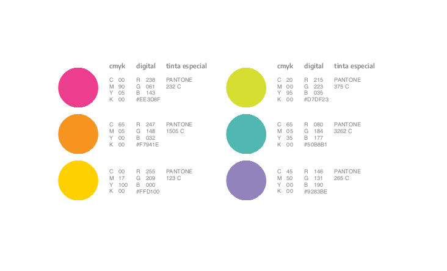
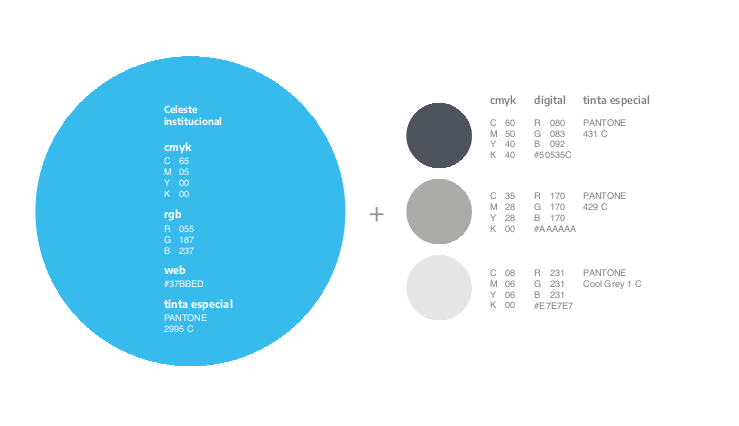

# comunicacion

<!-- badges: start -->
<!-- badges: end -->

<br>

`{comunicacion}` ofrece herramientas que facilitan la visualización de datos en la Dirección Nacional de Mercados y Estadísticas (DNMyE-MINTURDEP)

#### Colores institucionales
<a></a>

<a></a>

<br>


## Instrucciones de instalación :building_construction:

Versión en desarrollo:

``` r
devtools::install_github("d4t4tur/comunicacion")
```


<br>

## Funciones :test_tube:

    - `dnmye_colores()`
    
    - `dnmye_paletas()`
    
    - `import_encode()`
    
    - `scale_color_dnmye()`
    
    - `scale_fill_dnmye()`


<br> 

## Modo de uso

Estos son ejemplos básicos sobre cómo utilizar las funciones de la librería:


```{r}
library(comunicacion)

# Obtengo la paleta completa
comunicacion::dnmye_colores()
comunicaion::
```


## Cómo contribuir con el proyecto :twisted_rightwards_arrows:

Para colaborar en este proyecto, se recomienda hacer un Fork, trabajar sobre ese repositorio y, antes de hacer el pull request, correr el `devtools::check()` para garantizar que no haya conflictos.


